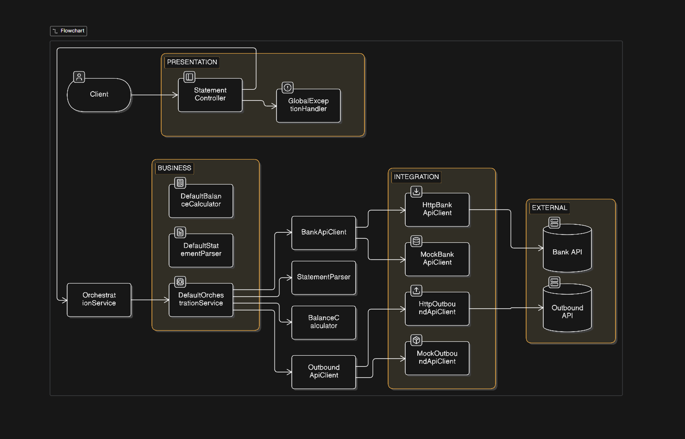

# Monthly Statement Processing Service

A Spring Boot application that fetches monthly bank statements from an external API, parses transactions, calculates the monthly balance (income, spending, and net balance), and sends the computed result to an outbound API. The application follows a layered architecture with dependency injection, comprehensive testing, Docker support, CI/CD, and cloud deployment.

---

## Live Demo

- **Application:** https://monthly-statements-production.up.railway.app
- **Swagger UI:** https://monthly-statements-production.up.railway.app/swagger-ui/index.html
- **OpenAPI Docs:** https://monthly-statements-production.up.railway.app/v3/api-docs

---

## Architecture



The application follows a **Layered Architecture** to separate responsibilities and keep the codebase maintainable.

### Presentation Layer
Responsible for exposing REST endpoints and handling HTTP requests/responses.

- `StatementController`
- `GlobalExceptionHandler`

### Business Layer
Contains the core business logic.

- `DefaultOrchestrationService`
- `DefaultStatementParser`
- `DefaultBalanceCalculator`

The orchestration service coordinates the complete workflow:
1. Fetch transactions from the Bank API.
2. Parse the received data.
3. Calculate monthly totals.
4. Send the computed balance to the outbound API.
5. Return the result to the client.

### Integration Layer
Responsible for communicating with external services.

Interfaces:
- `BankApiClient`
- `OutboundApiClient`

Implementations:
- `HttpBankApiClient`
- `MockBankApiClient`
- `HttpOutboundApiClient`
- `MockOutboundApiClient`

Using interfaces allows switching between **real** and **mock** implementations through Spring Profiles without changing the business logic.

### External Systems
- Bank Statement API
- Outbound Monthly Balance API

---

## Testing

The project includes multiple levels of testing:

- **Unit Tests** – Business logic and service components.
- **Controller Tests** – REST endpoint validation and exception handling.
- **Integration Tests** – Spring Boot context and component integration.
- **End-to-End Tests** – Cucumber + WireMock for mocking external APIs and validating complete request flows.

Run all tests:

```bash
./mvnw clean test
```

---

## Technologies

- Java 17
- Spring Boot
- Spring Web
- Spring Security
- Spring Data JPA
- JUnit 5
- Mockito
- Cucumber
- WireMock
- OpenAPI / Swagger
- Docker
- GitHub Actions
- Railway

---

## Deployment

The application is containerized using **Docker**, automatically built and tested using **GitHub Actions**, and deployed to **Railway**.

---

## Running Locally

```bash
./mvnw spring-boot:run
```

The application uses the **mock** Spring profile for local development, allowing the system to run without requiring the real external Bank or Outbound APIs.

---

## API

### Health Check

```http
GET /api/statements/health
```

### Process Monthly Statement

```http
POST /api/statements/process
```

Example request:

```json
{
  "accountId": "acct-1",
  "month": "2026-07"
}
```